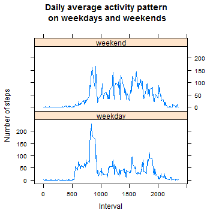

```
## [1] "English_United States.1252"
```

## Loading and preprocessing the data


The original data "activity.csv" is loacted in the working directory. After reading the file, the following preparatory steps were taken for the analysis: 

- convert the date column into date format
- convert intervals to "numeric" format (to make sure that grouping this variable gives the appropriate order)


```r
library(dplyr)
x<-read.csv("activity.csv",header=TRUE,
            colClasses=c("numeric","character","character"))
x$date<-as.Date(x$date)
x$interval<-as.numeric(x$interval)
head(x)
```

```
##   steps       date interval
## 1    NA 2012-10-01        0
## 2    NA 2012-10-01        5
## 3    NA 2012-10-01       10
## 4    NA 2012-10-01       15
## 5    NA 2012-10-01       20
## 6    NA 2012-10-01       25
```


## What is mean total number of steps taken per day?

The number of total steps each day is calculated, result shown in the "sum" column. At the same time I would like to see the status of NAs in the data table. The "count" column shows the number of valid data points, and the "na" column shows the number of NAs for the respective day. 


```r
y<-group_by(x,date)
daysum<-summarize(y,sum=sum(steps,na.rm=TRUE),
                         count=sum(!is.na(steps)),
                         na=sum(is.na(steps)))
head(daysum)
```

```
## Source: local data frame [6 x 4]
## 
##         date   sum count  na
## 1 2012-10-01     0     0 288
## 2 2012-10-02   126   288   0
## 3 2012-10-03 11352   288   0
## 4 2012-10-04 12116   288   0
## 5 2012-10-05 13294   288   0
## 6 2012-10-06 15420   288   0
```

I wanted to check if there were any days where only partial data were available, I have done this by subsetting the days where the the number of data points (count column) is less than the daily number of intervals, 288. 


```r
daysum[daysum$count<288,]
```

```
## Source: local data frame [8 x 4]
## 
##          date sum count  na
## 1  2012-10-01   0     0 288
## 8  2012-10-08   0     0 288
## 32 2012-11-01   0     0 288
## 35 2012-11-04   0     0 288
## 40 2012-11-09   0     0 288
## 41 2012-11-10   0     0 288
## 45 2012-11-14   0     0 288
## 61 2012-11-30   0     0 288
```

From the counts of valid data points and NAs we can see that in any given day there are either 288 valid data points or none. In other words, we have days with complete data and days with no data at all. 

If we look at the summary of the vector containing the total number of steps each day, we get the following result: 


```r
summary(daysum$sum)
```

```
##    Min. 1st Qu.  Median    Mean 3rd Qu.    Max. 
##       0    6778   10400    9354   12810   21190
```

According to this summary:

- the mean of total number of steps per day: **mean=9354**
- the median of total number of steps per day: **median=10400**.

However, it is likely that the 0 steps is a result of no measure that day (i.e. equivalent to NAs), therefore I calculated the data to exclude 0 from the average. 


```r
mean(daysum$sum[daysum$sum>0]) 
```

```
## [1] 10766.19
```

```r
median(daysum$sum[daysum$sum>0]) 
```

```
## [1] 10765
```

This calculation shows the following results: 
- the mean of total number of steps per day: **mean=10766**
- the median of total number of steps per day: **median=10765**.

The frequencies of the total number of steps taken each day are shown in a histogram: 


```r
hist(daysum$sum,breaks=10,
     main="Histogram of total number of steps per day",
     xlab="Total number of steps per day")
```

 


## What is the average daily activity pattern?

Calculation of the sum of all steps taken in the same interval each day (NAs excluded) are stored in the "ivsum" table.


```r
y<-x[complete.cases(x),]
y<-group_by(y,interval)
ivsum<-summarize(y,mean=mean(steps))
head(ivsum)
```

```
## Source: local data frame [6 x 2]
## 
##   interval      mean
## 1        0 1.7169811
## 2        5 0.3396226
## 3       10 0.1320755
## 4       15 0.1509434
## 5       20 0.0754717
## 6       25 2.0943396
```

The plot of the daily activity pattern: 


```r
plot(ivsum$mean,type="l",
     main="Daily activity pattern",
     xlab="Interval",
     ylab="Average number of steps")
```

 

To get the interval with the highest average activity I searched in the "ivsum" table for the interval where the average activity is the maximum and took the respective time element. 


```r
ivsum[which(ivsum$mean==max(ivsum$mean)),]
```

```
## Source: local data frame [1 x 2]
## 
##     interval     mean
## 104      835 206.1698
```

The highest average activity occurs in the ***time interval between 08:35 and 08:40.*** 

## Imputing missing values

When calling the summary() function on the "daysum" table in a previous section, it returned 8 days with NA. NAs were also counted each day showing that these 8 days have no data at all (288 NAs), while the other days are complete (0 NAs). This means that 288 daily interval is missing for 8 days, therefore the **total number of missing values is 288x8=2304**. 
 
As a verification, I also run the is.na() function on the "steps" column of the original data set "x", and it shows the same result. 


```r
sum(is.na(x$steps))
```

```
## [1] 2304
```

**As a strategy to fill the missing values, I chose to take the mean of the respective intervals** (data available in the "ivsum" table, in the "mean" column). "steps" data with inputed  missing values are added to the "x" data frame in column "steps1". 


```r
x<-mutate(x,steps1=steps)

for (i in 1:nrow(x))
{  if (is.na(x$steps[i])==TRUE)
   {x$steps1[i]<-ivsum$mean[which(ivsum$interval==x$interval[i])]}
}
```

A new data table is created, called "z". The first column is "step1s" from the "x" table (identical to the original "steps" data, except missing values are filled with respective interval means). "date" and "interval" columns are also taken from the "x" table, these are already converted to the appropriate format for the analysis. 


```r
z<-select(x,steps=steps1,date,interval)
head(z)
```

```
##       steps       date interval
## 1 1.7169811 2012-10-01        0
## 2 0.3396226 2012-10-01        5
## 3 0.1320755 2012-10-01       10
## 4 0.1509434 2012-10-01       15
## 5 0.0754717 2012-10-01       20
## 6 2.0943396 2012-10-01       25
```

The histogram of total number of steps taken each day calculated from the z table: 


```r
y<-group_by(z,date)
daysumz<-summarize(y,sum=sum(steps))

hist(daysumz$sum,breaks=10,
     main="Histogram of total number of steps per day",
     xlab="Total number of steps per day (NAs inputed)")
```

 

The summary() function is used to find the mean and median values of the new data set:


```r
mean(daysumz$sum)
```

```
## [1] 10766.19
```

```r
median(daysumz$sum)
```

```
## [1] 10766.19
```

In the new dataset where missing values are filled with the mean of the respective intervals, ***the median and the mean are identical, 10766.*** The mean equals to the mean of the original data set (this is what I expected, because the NAs were filled with mean values). The median of the data differs (10766 versus 10765 in the original data set). 

## Are there differences in activity patterns between weekdays and weekends?

In order to analyze the difference of weekdays and weekends, a new variable of "day" is created to specify the day of the week. Form this the days could be classified as weekend or weekday in a new variable called "daytype". 


```r
z$date<-as.Date(z$date)
z<-mutate(z,day=weekdays(date),daytype="weekday")
z$daytype[z$day=="Saturday"|z$day=="Sunday"]<-"weekend"
z$daytype<-as.factor(z$daytype)
head(z)
```

```
##       steps       date interval    day daytype
## 1 1.7169811 2012-10-01        0 Monday weekday
## 2 0.3396226 2012-10-01        5 Monday weekday
## 3 0.1320755 2012-10-01       10 Monday weekday
## 4 0.1509434 2012-10-01       15 Monday weekday
## 5 0.0754717 2012-10-01       20 Monday weekday
## 6 2.0943396 2012-10-01       25 Monday weekday
```

The mean number of steps calculated by daytype and interval, and stored in the "wdaysum" table. 


```r
z<-group_by(z,daytype,interval)
wdaysum<-summarize(z,mean=mean(steps))
```

The weekend and weekday activity patterns are plotted in the graph below: 


```r
library(lattice)
xyplot(mean ~ interval | daytype, wdaysum,type="l",
      main="Daily average activity pattern \non weekdays and weekends",
      xlab="Interval",
      ylab="Number of steps",
      layout=c(1,2))    
```

 

The plot shows that there is more intense activity in the weekends during the day and even the evenings. To visualize the difference more precisely, I also plotted the difference between the weekend and weekday mean steps per interval.  


```r
d<-data.frame(cbind(interval=wdaysum$interval[1:288],
                    difference=wdaysum$mean[289:576]-wdaysum$mean[1:288]))

xyplot(difference ~ interval,d,type="l",
main="Difference between \nweekend and weekday activity patterns",
xlab="Interval",
ylab="Difference in mean number of steps",
panel=function(...) { 
           panel.xyplot(...) 
           panel.abline(h=0,lty = "dotted")
       }) 
```

 

The value of the plot is above 0 when the weekend average activity is higher and below 0 when the weekday average activity is higher.This shows more clearly, that there is higher activity on weekdays in the morning hours (between about 6am and 9am). Between 9am and 10pm in most intervals the weekend activity is higher. Between 10pm and 6am the difference between weekend and weekday activity is minimal.   
